# EdgeFirst Perception for GStreamer: Software Architecture

**Version:** 1.0
**Date:** February 2026

---

## Table of Contents

1. [Overview](#1-overview)
2. [High-Level Architecture](#2-high-level-architecture)
3. [Data Structures and Caps](#3-data-structures-and-caps)
4. [Plugin Modules and Elements](#4-plugin-modules-and-elements)
5. [Zenoh Bridge Architecture](#5-zenoh-bridge-architecture)
6. [OpenGL Visualization (Roadmap)](#6-opengl-visualization----roadmap)
7. [Calibration Data Flow](#7-calibration-data-flow)
8. [Debug Categories](#8-debug-categories)
9. [Build System and Project Layout](#9-build-system-and-project-layout)
10. [References](#10-references)

---

## 1. Overview

### 1.1 Purpose

EdgeFirst Perception for GStreamer (`edgefirst-gstreamer`) extends the EdgeFirst
Perception platform by bridging Zenoh/CDR messaging with GStreamer pipelines for
spatial perception workloads.

The framework provides:

- **ROS2-compatible data structures** as GStreamer caps and metadata
  (PointCloud2, RadarCube, Image, Transform, CameraInfo)
- **Zenoh bridge elements** for subscribing to and publishing on EdgeFirst
  Perception topics
- **NNStreamer integration** with RadarCube stored as tensors for direct
  inference
- **Calibration handling** with late-binding injection of intrinsic/extrinsic
  parameters via GstMeta
- **Point cloud classification** for projecting camera segmentation masks onto
  point clouds
- **Hardware-accelerated ML preprocessing** fusing color conversion, resize,
  letterbox, and quantization into a single element with DMA-BUF zero-copy
- **OpenGL visualization** (roadmap) for point cloud overlay and radar cube
  heatmap rendering

### 1.2 Design Principles

1. **GStreamer-native patterns**: Follow established GStreamer plugin conventions
   for caps negotiation, buffer management, and element state machines.

2. **Higher-level APIs first**: Use high-level GStreamer base classes unless a
   concrete limitation requires a lower-level implementation.

3. **NNStreamer compatibility**: Leverage NNStreamer's tensor infrastructure for
   seamless integration with inference pipelines.

4. **Zero-copy where possible**: Use DMA-BUF for buffer sharing across pipeline
   elements and with external consumers.

5. **Clean C11 implementation**: Modern C11 for portability and minimal
   dependencies.

6. **Modular architecture**: Separate libraries for core types, bridge elements,
   and visualizers enable minimal deployments.

7. **EdgeFirst namespace**: All EdgeFirst-specific symbols use the
   `Edgefirst`/`edgefirst_`/`EDGEFIRST_` namespace.

### 1.3 Conventions

| Category | Pattern | Example |
|----------|---------|---------|
| GObject types | `EdgefirstFooBar` | `EdgefirstZenohSub`, `EdgefirstPcdOverlay` |
| Functions | `edgefirst_foo_bar_*()` | `edgefirst_zenoh_sub_start()` |
| Cast macros | `EDGEFIRST_FOO_BAR(obj)` | `EDGEFIRST_PCD_OVERLAY(self)` |
| Type macros | `EDGEFIRST_TYPE_FOO_BAR` | `EDGEFIRST_TYPE_ZENOH_SUB` |
| Enum values | `EDGEFIRST_*` | `EDGEFIRST_RADAR_DIM_RANGE` |
| Constants | `EDGEFIRST_*` | `EDGEFIRST_FRAME_ID_MAX_LEN` |
| Debug categories | `"edgefirst*"` | `"edgefirstzenohsub"` |
| Source files | `edgefirst*.{c,h}` | `edgefirstzenohsub.c` |

---

## 2. High-Level Architecture

### 2.1 System Context

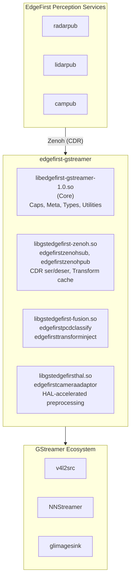

### 2.2 Module Architecture

The framework consists of four libraries:

| Library | Type | Description | Dependencies |
|---------|------|-------------|--------------|
| `libedgefirst-gstreamer-1.0.so` | Shared library | Caps definitions, GstMeta types, utilities | GStreamer, GLib |
| `libgstedgefirst-zenoh.so` | Plugin | Zenoh subscriber/publisher | Core, zenoh-c, edgefirst-schemas |
| `libgstedgefirst-fusion.so` | Plugin | Point cloud classification, calibration injection | Core, json-glib |
| `libgstedgefirsthal.so` | Plugin | Hardware-accelerated ML preprocessing | Core, edgefirst-hal |

### 2.3 Data Flow Patterns

**Pattern 1: LiDAR Point Cloud Visualization (solid background)**

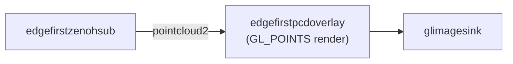

**Pattern 2: Point Cloud Overlay on Camera Image (calibrated)**

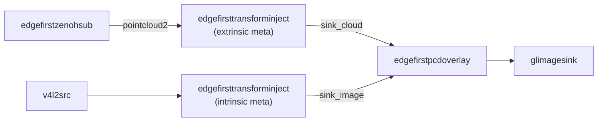

**Pattern 3: Radar Cube to Inference**

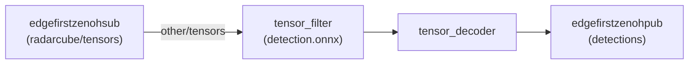

**Pattern 4: Point Cloud Painting with Camera Segmentation**

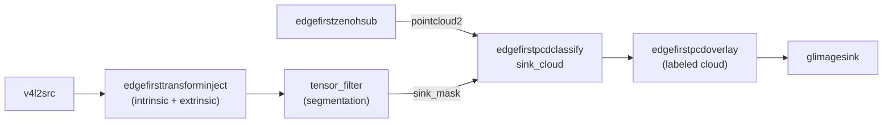

**Pattern 5: Fused Camera Preprocessing for ML Inference**

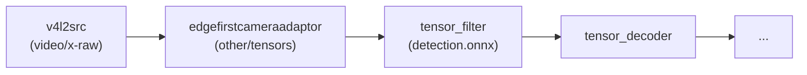

Replaces a multi-element preprocessing chain (`videoconvert ! videoscale !
tensor_converter ! tensor_transform ...`) with a single hardware-accelerated
step. On DMA-BUF capable platforms, achieves zero-copy from camera to NPU.

---

## 3. Data Structures and Caps

### 3.1 PointCloud2 Representation

**GstCaps:**

```
application/x-pointcloud2,
    width=(int)[1,MAX],
    height=(int)[1,MAX],
    point-step=(int)[1,MAX],
    fields=(string)"x:F32:0,y:F32:4,z:F32:8,intensity:U16:12",
    is-bigendian=(boolean)false,
    is-dense=(boolean)true
```

The `fields` string format: `name:type:offset[,...]` where type is one of:
`I8`, `U8`, `I16`, `U16`, `I32`, `U32`, `F32`, `F64`.

Maps directly to ROS2 `sensor_msgs/PointCloud2`.

**Metadata:** `EdgefirstPointCloud2Meta` carries point count, frame ID, ROS
timestamp, and an optional embedded transform.

**Memory layout:**

```mermaid
flowchart TD
    subgraph buf["GstBuffer"]
        direction TB
        mem["<b>GstMemory 0 — Point data</b><br>Point 0..N: &#91;x:f32&#93;&#91;y:f32&#93;&#91;z:f32&#93;&#91;intensity:u16&#93;…"]
        pc2[EdgefirstPointCloud2Meta]
        xf["EdgefirstTransformMeta (optional)"]
        ref["GstReferenceTimestampMeta (optional: PTP)"]
        mem --- pc2 --- xf --- ref
    end
```

### 3.2 RadarCube as NNStreamer Tensor

**GstCaps:**

```
other/tensors,
    num-tensors=(int)1,
    types=(string)"int16",
    dimensions=(string)"1:64:256:2",
    format=(string)static
```

Tensor dimensions follow row-major convention. Complex data uses innermost
dimension of size 2 when `is_complex=true`.

**Metadata:** `EdgefirstRadarCubeMeta` carries dimension layout (range, doppler,
azimuth, elevation, etc.), per-dimension scales, complex flag, radar timestamp,
and frame ID.

### 3.3 Transform and Calibration Data

**`EdgefirstTransformData`** represents a rigid 3D transform (translation +
quaternion rotation) between named coordinate frames. Maps to ROS2
`geometry_msgs/TransformStamped`.

**`EdgefirstCameraInfoMeta`** carries camera intrinsic calibration: image
dimensions, 3x3 intrinsic matrix K, distortion coefficients D, rectification
matrix R, and 3x4 projection matrix P. Supports plumb bob (Brown-Conrady),
equidistant (fisheye), and rational polynomial distortion models. Maps to ROS2
`sensor_msgs/CameraInfo`.

### 3.4 Metadata Relationships

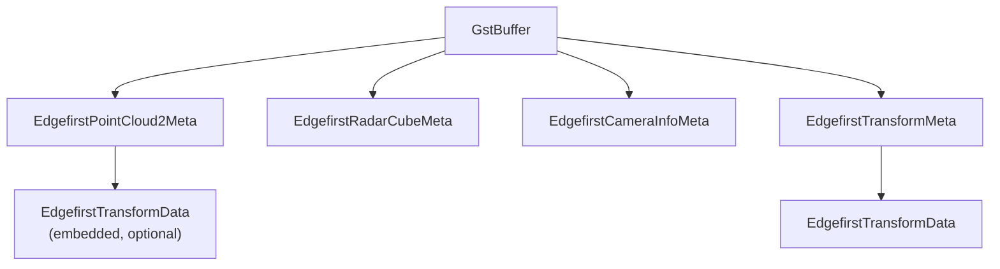

Point cloud buffers carry `EdgefirstPointCloud2Meta` (always) and optionally
`EdgefirstTransformMeta` (extrinsic calibration). Image buffers carry
`EdgefirstCameraInfoMeta` (intrinsic calibration). Both metadata types may
be attached by `edgefirsttransforminject` or deserialized from Zenoh messages.

---

## 4. Plugin Modules and Elements

### 4.1 libedgefirst-gstreamer-1.0.so (Core)

The core library provides caps registration, GstMeta types, and utility
functions. It contains no elements but is a required dependency for all other
modules.

**Registered metadata types:** `EdgefirstPointCloud2Meta`,
`EdgefirstRadarCubeMeta`, `EdgefirstCameraInfoMeta`, `EdgefirstTransformMeta`.

**Utilities:** metadata type registration, quaternion transform application,
pinhole camera projection, point field parsing/formatting.

---

### 4.2 libgstedgefirst-zenoh.so (Zenoh Bridge)

#### 4.2.1 edgefirstzenohsub

Subscribes to Zenoh topics and produces GStreamer buffers.

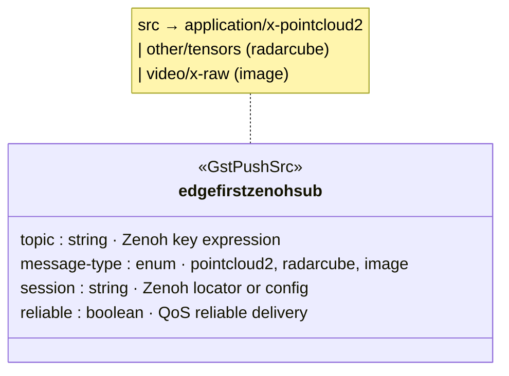

**State machine:**

| Transition | Action |
|------------|--------|
| NULL → READY | Open Zenoh session, subscribe to `/tf_static` for transform cache |
| READY → PAUSED | Create subscriber on configured topic |
| PAUSED → PLAYING | Start pushing buffers from queue |
| PLAYING → PAUSED | Pause delivery (buffer queue continues filling) |
| PAUSED → READY | Destroy subscriber |
| READY → NULL | Close session, drain buffer queue |

#### 4.2.2 edgefirstzenohpub

Publishes GStreamer buffers to Zenoh topics.

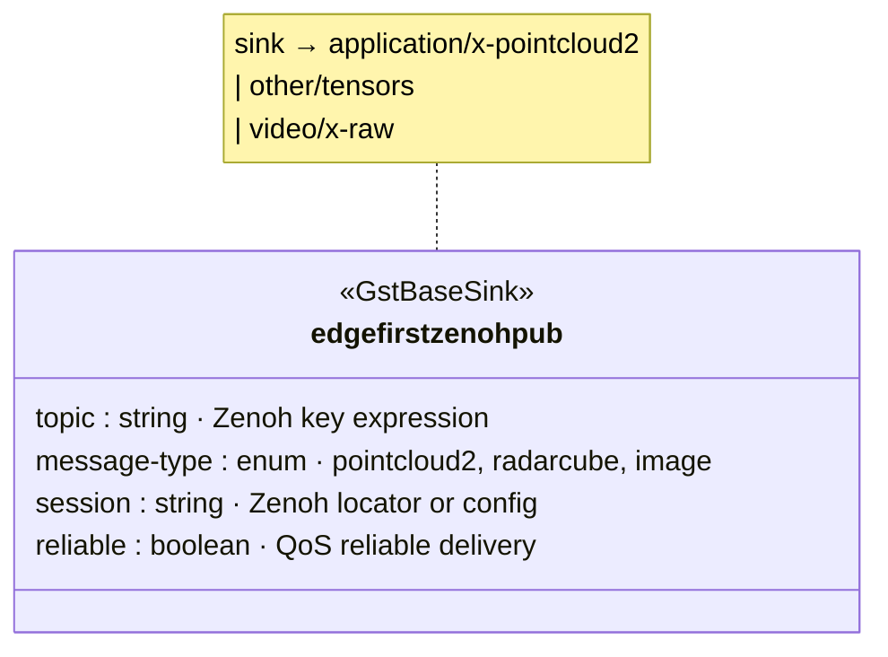

#### 4.2.3 Message Type Mappings

| GstCaps | message-type | ROS2 Message |
|---------|--------------|--------------|
| `application/x-pointcloud2` | pointcloud2 | `sensor_msgs/PointCloud2` |
| `other/tensors` + `EdgefirstRadarCubeMeta` | radarcube | `edgefirst/RadarCube` |
| `video/x-raw` | image | `sensor_msgs/Image` |

Additional Zenoh topics consumed internally (not exposed as message-type):
- `sensor_msgs/CameraInfo` → attached as `EdgefirstCameraInfoMeta`
- `tf2_msgs/TFMessage` → cached for transform lookup

---

### 4.3 libgstedgefirst-gfx.so (Visualization) -- Roadmap

> **Roadmap:** The GFX module is planned but not yet implemented. It will
> provide GPU-accelerated OpenGL visualization elements including point cloud
> overlay (`edgefirstpcdoverlay`) and radar cube heatmap rendering
> (`edgefirstradarcubedraw`). See Section 6 for the planned design.

---

### 4.4 libgstedgefirst-fusion.so (Processing)

#### 4.4.1 edgefirstpcdclassify

Projects camera segmentation masks onto point clouds, assigning semantic
labels to each point based on the corresponding pixel.

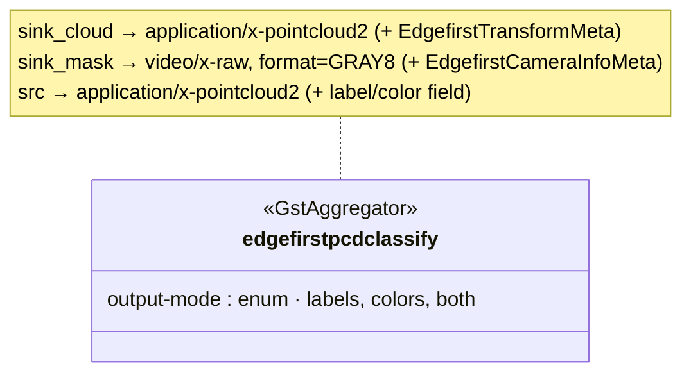

**Processing flow:**
1. Read XYZ from point cloud, apply extrinsic transform (lidar→camera)
2. Project transformed point to image plane via intrinsic calibration
3. Look up segmentation mask value at projected pixel coordinates
4. Write label to output point cloud buffer

#### 4.4.2 edgefirsttransforminject

Attaches transform and/or camera calibration metadata to buffers passing
through. Operates as an in-place transform element with passthrough disabled
(required for metadata injection).

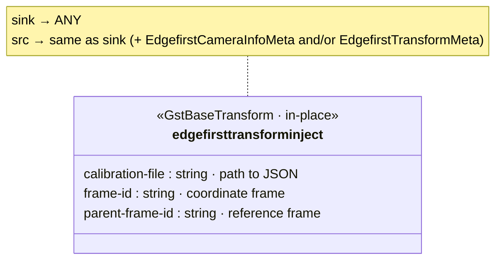

---

### 4.5 libgstedgefirsthal.so (HAL Preprocessing)

#### 4.5.1 edgefirstcameraadaptor

Hardware-accelerated fused image preprocessing for ML inference. Replaces
verbose multi-element chains (`videoconvert ! videoscale ! tensor_converter !
tensor_transform`) with a single element that auto-selects the optimal backend
(G2D, OpenGL, or CPU) based on the platform.

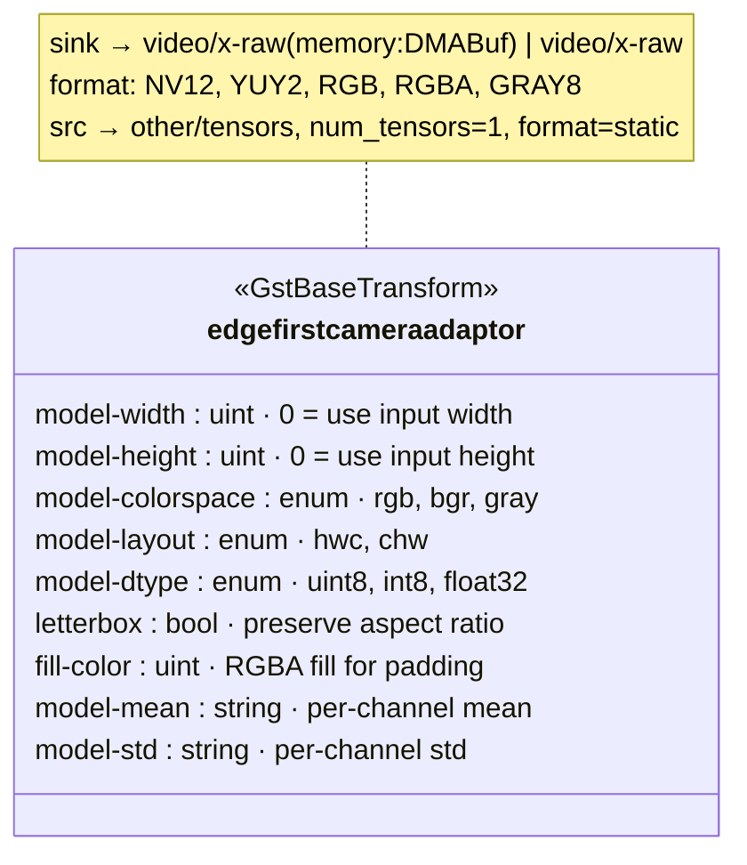

**Processing pipeline:**
1. Wrap input video frame (DMA-BUF zero-copy or memcpy fallback)
2. Fused color conversion, resize, and optional letterbox in one
   hardware-accelerated pass
3. Post-process: XOR 0x80 for int8 quantization, or per-channel mean/std
   normalization for float32
4. Output to GstBuffer as NNStreamer-compatible tensor

**Output caps:** NNStreamer-compatible `other/tensors` with dimensions ordered
innermost-to-outermost. For HWC layout, dimensions are `"C:W:H:1"`;
for CHW layout, dimensions are `"W:H:C:1"`.

**Letterbox:** When `letterbox=true`, the source image is scaled to fit the
target dimensions while preserving aspect ratio. Padding regions are filled
with `fill-color`. The crop geometry is computed once per caps change.

#### 4.5.2 DMA-BUF Zero-Copy

The element supports three memory tiers, negotiated automatically:

| Tier | Input | Output | Description |
|------|-------|--------|-------------|
| 1 (full zero-copy) | DMA-BUF fd | DMA-BUF fd | Camera → HAL → NPU, no copies |
| 2 (output only) | System memory | DMA-BUF fd | HAL → NPU zero-copy |
| 3 (fallback) | System memory | System memory | Always works, software path |

DMA-BUF is only proposed to upstream when the platform supports it (i.e.,
`/dev/dma_heap/` exists). This prevents allocation failures on x86_64
development hosts.

#### 4.5.3 Conversion Paths

| Target dtype | Target layout | Post-processing |
|-------------|---------------|-----------------|
| uint8 | HWC | BGR swap if needed |
| uint8 | CHW | Plane swap if BGR |
| int8 | HWC/CHW | XOR 0x80 per byte |
| float32 | HWC/CHW | `(pixel/255 - mean) / std` |

---

### 4.6 Element Summary

| Library | Element | Base Class | Description |
|---------|---------|------------|-------------|
| zenoh | `edgefirstzenohsub` | `GstPushSrc` | Zenoh topic subscriber |
| zenoh | `edgefirstzenohpub` | `GstBaseSink` | Zenoh topic publisher |
| fusion | `edgefirstpcdclassify` | `GstAggregator` | Mask-to-cloud projection |
| fusion | `edgefirsttransforminject` | `GstBaseTransform` | Calibration injection |
| hal | `edgefirstcameraadaptor` | `GstBaseTransform` | Fused ML preprocessing |

---

## 5. Zenoh Bridge Architecture

### 5.1 Session Management

The `session` property accepts a Zenoh locator or path to a JSON5 config file:

```bash
# Direct locator
edgefirstzenohsub session="tcp/192.168.1.100:7447"

# Configuration file
edgefirstzenohsub session="/etc/edgefirst/zenoh.json5"
```

Sessions are opened during `NULL→READY` and closed during `READY→NULL`.

### 5.2 Transform Cache

The Zenoh bridge maintains a cache of transforms received from `/tf_static`
topics. These transforms are automatically attached to point cloud buffers
based on their `frame_id` header field.

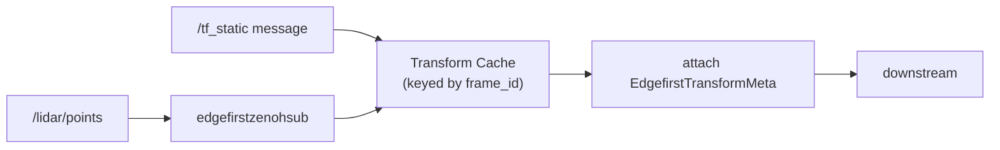

### 5.3 Error Handling

> **Roadmap:** Advanced error recovery (exponential backoff reconnection,
> consecutive error counting, buffer drop counters) is planned but not yet
> implemented. Current error handling uses basic `GST_ELEMENT_ERROR` reporting.

**Buffer queue bounds:** The internal buffer queue has a maximum depth (default:
16 buffers). When full, the oldest buffer is dropped to prevent unbounded memory
growth. Drops are logged at `GST_DEBUG` level.

---

## 6. OpenGL Visualization -- Roadmap

> **Roadmap:** This section describes the planned OpenGL visualization pipeline.
> The GFX module is not yet implemented.

### 6.1 Point Cloud Overlay Rendering

The `edgefirstpcdoverlay` element will use GPU-accelerated OpenGL to render
3D points as `GL_POINTS`. It will inherit from `GstAggregator` (not
`GstGLBaseMixer`, because `GstVideoAggregator` enforces video caps on all
sink pads) and must acquire a GL context explicitly.

**Rendering pipeline:**

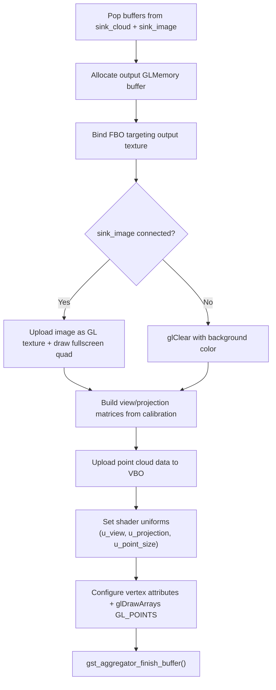

### 6.2 Radar Cube Heatmap Rendering

The `edgefirstradarcubedraw` element extracts a 2D slice from the
multi-dimensional tensor and renders it as a heatmap texture:

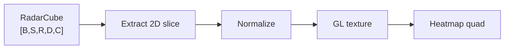

Normalization modes: linear, abs, log (dB scale), abslog.

### 6.3 Target Platform Capabilities

| Platform | GPU | OpenGL ES | Est. Point Capacity |
|----------|-----|-----------|---------------------|
| NXP i.MX 8M Plus | Vivante GC7000UL | ES 3.1 | ~200K points @ 10Hz |
| NXP i.MX 95 | ARM Mali-G310 | ES 3.2 | ~500K points @ 10Hz |
| Jetson Orin Nano | NVIDIA Ampere | ES 3.2 | 2M+ points @ 10Hz |

Requires OpenGL ES 3.0+ or OpenGL 3.3+.

---

## 7. Calibration Data Flow

### 7.1 Overview

Calibration data flows through the pipeline as GstMeta attached to buffers:

| Calibration | Metadata Type | Describes | Attached To |
|-------------|---------------|-----------|-------------|
| Extrinsic | `EdgefirstTransformMeta` | Rigid transform between sensor and camera frame | Point cloud buffers |
| Intrinsic | `EdgefirstCameraInfoMeta` | Camera projection model (K, D, R, P) | Image buffers |

### 7.2 Injection Methods

**1. `edgefirsttransforminject` element (file-based):**
- Parses a JSON calibration file at element start
- Attaches metadata to every buffer passing through
- Suitable for static calibrations (fixed sensor mount)

**2. Zenoh bridge (message-based):**
- `sensor_msgs/CameraInfo` messages attached as `EdgefirstCameraInfoMeta`
- `tf2_msgs/TFMessage` from `/tf_static` cached and attached via transform
  cache lookup
- Suitable for dynamic or remotely-managed calibrations

### 7.3 Calibration JSON Format

```json
{
  "camera_info": {
    "width": 1920,
    "height": 1080,
    "K": [1000.0, 0.0, 960.0, 0.0, 1000.0, 540.0, 0.0, 0.0, 1.0],
    "D": [0.0, 0.0, 0.0, 0.0, 0.0],
    "distortion_model": "plumb_bob",
    "R": [1, 0, 0, 0, 1, 0, 0, 0, 1],
    "P": [1000.0, 0.0, 960.0, 0.0, 0.0, 1000.0, 540.0, 0.0, 0.0, 0.0, 1.0, 0.0]
  },
  "transform": {
    "translation": [0.1, -0.05, 0.0],
    "rotation": [0.0, 0.0, 0.0, 1.0],
    "child_frame_id": "lidar",
    "parent_frame_id": "camera"
  }
}
```

Either `camera_info` or `transform` may be omitted if only one type of
calibration is needed.

### 7.4 Default Calibration

When no calibration metadata is present on buffers:

- **Extrinsic default**: Identity transform (no rotation, no translation).
- **Intrinsic default**: Generic rectified pinhole with `fx = fy = width`
  (~53 degree HFOV), `cx = width/2`, `cy = height/2`, no distortion.

### 7.5 Projection Pipeline

For each 3D point in the point cloud:

```
P_sensor = [x, y, z]                                    # Sensor frame
P_camera = extrinsic.rotation * P_sensor + extrinsic.translation  # Camera frame
[u, v]   = intrinsic.project(P_camera)                  # Image coordinates
```

Pinhole projection: `u = fx * (x/z) + cx`, `v = fy * (y/z) + cy`.
Points behind the camera (z <= 0) are rejected.

### 7.6 Calibration Metadata Propagation

| Pipeline Stage | Buffer Type | Metadata Present |
|----------------|-------------|------------------|
| `edgefirstzenohsub` output | Point cloud | `EdgefirstPointCloud2Meta` (+ `EdgefirstTransformData` if `/tf_static` available) |
| After `edgefirsttransforminject` (lidar branch) | Point cloud | + `EdgefirstTransformMeta` (extrinsic) |
| After `edgefirsttransforminject` (camera branch) | Image | + `EdgefirstCameraInfoMeta` (intrinsic) |
| `edgefirstpcdclassify` input | Both | Extrinsic from `sink_cloud`, intrinsic from `sink_mask` |

---

## 8. Debug Categories

Each element registers its own `GST_DEBUG` category. All categories use the
`edgefirst` prefix, enabling bulk control via `GST_DEBUG=edgefirst*:5`.

| Category | Source | Scope |
|----------|--------|-------|
| `edgefirstzenohsub` | Zenoh subscriber | Session lifecycle, callbacks, queue |
| `edgefirstzenohpub` | Zenoh publisher | Session lifecycle, serialization |
| `edgefirstpcdclassify` | Point cloud classify | Projection, label assignment |
| `edgefirsttransforminject` | Transform inject | File parsing, metadata injection |
| `edgefirstcameraadaptor` | Camera adaptor | HAL conversion, DMA-BUF, tensor output |

**Logging level conventions:**

- `GST_LOG`: Per-buffer operations
- `GST_DEBUG`: State changes, configuration, periodic statistics
- `GST_INFO`: Session open/close, subscriber declare/undeclare
- `GST_WARNING`: Recoverable errors (malformed messages, missing calibration)
- `GST_ERROR`: Fatal errors (session failure)

---

## 9. Build System and Project Layout

### 9.1 Project Structure

```
edgefirst-gstreamer/
├── meson.build
├── meson_options.txt
├── LICENSE                       (Apache-2.0)
├── README.md
│
├── gst-libs/
│   └── gst/
│       └── edgefirst/
│           ├── meson.build
│           ├── edgefirst.h
│           ├── edgefirst.c
│           ├── edgefirst-perception-types.h
│           ├── edgefirstpointcloud2meta.{h,c}
│           ├── edgefirstradarcubemeta.{h,c}
│           ├── edgefirsttransformmeta.{h,c}
│           └── edgefirstcamerainfometa.{h,c}
│
├── gst/
│   ├── zenoh/
│   │   ├── meson.build
│   │   ├── plugin.c
│   │   ├── edgefirstzenohsub.{h,c}
│   │   ├── edgefirstzenohpub.{h,c}
│   │   ├── edgefirstzenoh-enums.{h,c}
│   │   └── transform-cache.{h,c}
│   │
│   ├── fusion/
│   │   ├── meson.build
│   │   ├── plugin.c
│   │   ├── edgefirstpcdclassify.{h,c}
│   │   └── edgefirsttransforminject.{h,c}
│   │
│   └── hal/
│       ├── meson.build
│       ├── plugin.c
│       ├── edgefirstcameraadaptor.{h,c}
│       └── edgefirstcameraadaptor-neon.{h,c}
│
├── tests/
│   ├── meson.build
│   ├── check/
│   │   ├── test_meta.c
│   │   ├── test_meta_copy.c
│   │   ├── test_math.c
│   │   ├── test_fusion_elements.c
│   │   └── test_hal_elements.c
│   └── fixtures/
│       ├── test_calibration.json
│       └── test_calibration_invalid.json
│
├── examples/
│   ├── camera_calibration.json
│   ├── zenoh.json5
│   ├── pipeline_camera_adaptor.sh
│   └── pipeline_radar_inference.sh
│
├── ARCHITECTURE.md
└── TESTING.md
```

### 9.2 Dependencies

#### Required

| Dependency | Version | Purpose |
|------------|---------|---------|
| GStreamer | >= 1.20 | Core framework |
| GLib | >= 2.56 | Base utilities |

#### Optional (Feature-Gated)

| Dependency | Feature | Purpose |
|------------|---------|---------|
| zenoh-c | `zenoh` | Zenoh bridge plugin |
| edgefirst-schemas | `zenoh` | CDR serialization/deserialization |
| json-glib-1.0 | `fusion` | Calibration file parsing |
| edgefirst-hal | `hal` | Hardware-accelerated image processing |
| NNStreamer | -- | Tensor infrastructure (runtime, not build dep) |

### 9.3 Build Options

| Option | Default | Description |
|--------|---------|-------------|
| `zenoh` | auto | Build Zenoh bridge plugin |
| `fusion` | enabled | Build fusion processing plugin |
| `hal` | auto | Build HAL image processing plugin |
| `tests` | auto | Build unit tests |

### 9.4 Installation Paths

| Component | Path |
|-----------|------|
| Core library | `${libdir}/libedgefirst-gstreamer-1.0.so` |
| Plugin modules | `${libdir}/gstreamer-1.0/libgstedgefirst-*.so` |
| Headers | `${includedir}/gstreamer-1.0/gst/edgefirst/` |
| Pkg-config | `${libdir}/pkgconfig/edgefirst-gstreamer-1.0.pc` |

---

## 10. References

### GStreamer

| Resource | URL |
|----------|-----|
| GStreamer DMA Buffers Design | https://gstreamer.freedesktop.org/documentation/additional/design/dmabuf.html |
| GstAggregator API | https://gstreamer.freedesktop.org/documentation/base/gstaggregator.html |
| GstMeta Design | https://github.com/GStreamer/gst-docs/blob/master/markdown/additional/design/meta.md |
| GstGLFilter API | https://gstreamer.freedesktop.org/documentation/gl/gstglfilter.html |

### NNStreamer

| Resource | URL |
|----------|-----|
| NNStreamer Official | https://nnstreamer.ai/ |
| Data Type and Flow Control | https://nnstreamer.github.io/data-type-and-flow-control.html |
| tensor_filter Documentation | https://nnstreamer.github.io/gst/nnstreamer/tensor_filter/README.html |

### ROS2 Message Definitions

| Resource | URL |
|----------|-----|
| sensor_msgs/PointCloud2 | https://docs.ros2.org/latest/api/sensor_msgs/msg/PointCloud2.html |
| sensor_msgs/CameraInfo | https://docs.ros2.org/latest/api/sensor_msgs/msg/CameraInfo.html |
| geometry_msgs/TransformStamped | https://docs.ros2.org/latest/api/geometry_msgs/msg/TransformStamped.html |

### EdgeFirst and Zenoh

| Resource | URL |
|----------|-----|
| EdgeFirst HAL | https://github.com/EdgeFirstAI/hal |
| EdgeFirst Schemas | https://github.com/EdgeFirstAI/schemas |
| Zenoh Official | https://zenoh.io/ |
| Zenoh-C API | https://zenoh-c.readthedocs.io/ |

### Platform References

| Resource | URL |
|----------|-----|
| NXP i.MX 8M Plus | https://www.nxp.com/products/processors-and-microcontrollers/arm-processors/i-mx-applications-processors/i-mx-8-applications-processors/i-mx-8m-plus-arm-cortex-a53-machine-learning-vision-multimedia-and-industrial-iot:IMX8MPLUS |
| ARM Mali-G310 | https://developer.arm.com/Processors/Mali-G310 |
| Ouster OS1-64 | https://ouster.com/products/hardware/os1-lidar-sensor |

---

## Appendix A: Glossary

| Term | Definition |
|------|------------|
| **CDR** | Common Data Representation (ROS2/DDS serialization) |
| **CFAR** | Constant False Alarm Rate (radar detection algorithm) |
| **DMA-BUF** | DMA buffer sharing mechanism (Linux kernel) |
| **FBO** | Framebuffer Object (OpenGL render target) |
| **GstCaps** | GStreamer capabilities (format negotiation) |
| **GstMeta** | GStreamer buffer metadata |
| **HAL** | Hardware Abstraction Layer (edgefirst-hal image processing) |
| **NDC** | Normalized Device Coordinates (OpenGL clip space) |
| **NNStreamer** | Neural Network Streamer framework |
| **VBO** | Vertex Buffer Object (OpenGL) |
