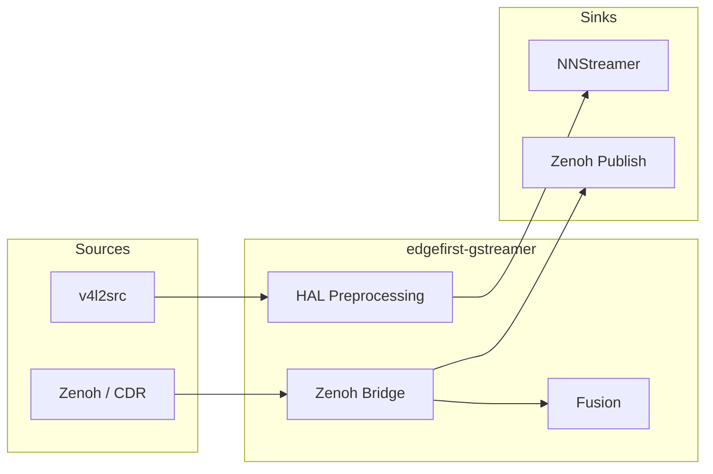

# EdgeFirst Perception for GStreamer

GStreamer elements for spatial perception workloads — LiDAR point clouds,
automotive radar cubes, camera preprocessing for ML inference, and sensor
fusion — with Zenoh bridge connectivity to the EdgeFirst Perception platform.



## Modules

| Plugin | Elements | Description |
|--------|----------|-------------|
| **Core library** | — | `EdgefirstPointCloud2Meta`, `EdgefirstRadarCubeMeta`, `EdgefirstTransformMeta`, `EdgefirstCameraInfoMeta` |
| `edgefirstzenoh` | `edgefirstzenohsub`, `edgefirstzenohpub` | Zenoh bridge: subscribe/publish PointCloud2, RadarCube, Image via CDR |
| `edgefirstfusion` | `edgefirstpcdclassify`, `edgefirsttransforminject` | Sensor fusion: segmentation mask projection, calibration injection |
| `edgefirsthal` | `edgefirstcameraadaptor` | Hardware-accelerated ML preprocessing: fused color conversion, resize, letterbox, quantization |

## Element Reference

| Element | Description | Key Properties |
|---------|-------------|----------------|
| `edgefirstzenohsub` | Subscribe to Zenoh topics and produce GStreamer buffers | `topic`, `message-type`, `session` |
| `edgefirstzenohpub` | Publish GStreamer buffers to Zenoh topics | `topic`, `message-type`, `session` |
| `edgefirstpcdclassify` | Project camera segmentation masks onto point clouds | `output-mode` |
| `edgefirsttransforminject` | Attach calibration metadata (intrinsic/extrinsic) to buffers | `calibration-file`, `frame-id` |
| `edgefirstcameraadaptor` | Fused image preprocessing for ML inference with DMA-BUF zero-copy | `model-width`, `model-height`, `model-dtype`, `letterbox` |

## Dependencies

| Dependency | Version | Required |
|------------|---------|----------|
| GStreamer | >= 1.20 | Yes |
| GLib | >= 2.56 | Yes |
| Meson | >= 0.62 | Build |
| Zenoh-C | latest | Zenoh plugin only |
| edgefirst-schemas | >= 1.5 | Zenoh plugin only |
| json-glib-1.0 | >= 1.0 | Fusion plugin only |
| edgefirst-hal | >= 0.6 | HAL plugin only |
| NNStreamer | >= 2.0 | Optional (radar tensor support) |

## Environment Setup

The project ships an `env.sh` script that downloads pre-compiled development
dependencies (zenoh-c, edgefirst-schemas, edgefirst-hal) for the host
architecture. Source it before building:

```sh
source env.sh
```

This sets `PKG_CONFIG_PATH` and `LD_LIBRARY_PATH` so that Meson can find the
dependencies automatically.

## Building

```sh
source env.sh
meson setup builddir
meson compile -C builddir
meson test -C builddir
```

To build only the core library and fusion plugin (no external sensor deps):

```sh
meson setup builddir -Dzenoh=disabled -Dhal=disabled
meson compile -C builddir
```

To build only core + HAL plugin:

```sh
source env.sh
meson setup builddir -Dzenoh=disabled -Dhal=enabled
meson compile -C builddir
```

### Build Options

| Option | Default | Description |
|--------|---------|-------------|
| `zenoh` | auto | Build Zenoh bridge plugin |
| `fusion` | enabled | Build fusion processing plugin |
| `hal` | auto | Build HAL image processing plugin |
| `tests` | auto | Build unit tests |

## Example Pipelines

### Radar Cube Inference

Radar cube → inference → detections published back to Zenoh:

```sh
gst-launch-1.0 \
  edgefirstzenohsub topic=rt/radar/cube message-type=radarcube \
  ! tensor_filter framework=tensorflow2-lite model=radar_detector.tflite \
  ! tensor_decoder mode=bounding_boxes \
  ! edgefirstzenohpub topic=rt/radar/detections message-type=image
```

### Camera Preprocessing for ML Inference

Fused preprocessing with `edgefirstcameraadaptor` — replaces
`videoconvert ! videoscale ! tensor_converter ! tensor_transform`:

```sh
gst-launch-1.0 \
  v4l2src ! video/x-raw,format=NV12,width=1920,height=1080 \
  ! edgefirstcameraadaptor model-width=640 model-height=640 model-dtype=uint8 \
  ! tensor_filter framework=tensorflow2-lite model=yolov8n.tflite \
  ! tensor_decoder mode=bounding_boxes \
  ! videoconvert ! autovideosink
```

### Letterbox Preprocessing with int8 Quantization

```sh
gst-launch-1.0 \
  v4l2src ! video/x-raw,format=NV12,width=1920,height=1080 \
  ! edgefirstcameraadaptor model-width=640 model-height=640 \
      model-dtype=int8 letterbox=true fill-color=0x808080FF \
  ! tensor_filter framework=tensorflow2-lite model=yolov8n_int8.tflite \
  ! fakesink
```

### Camera Segmentation → Labeled Point Cloud

Project camera segmentation masks onto a LiDAR point cloud:

```sh
gst-launch-1.0 \
  edgefirstzenohsub topic=rt/lidar/points message-type=pointcloud2 \
  ! edgefirsttransforminject calibration-file=examples/camera_calibration.json \
  ! edgefirstpcdclassify name=classify output-mode=labels \
  v4l2src \
  ! video/x-raw,format=NV12,width=1920,height=1080 \
  ! edgefirstcameraadaptor model-width=512 model-height=512 model-dtype=uint8 \
  ! tensor_filter framework=tensorflow2-lite model=segmentation.tflite \
  ! tensor_decoder mode=image_segment \
  ! video/x-raw,format=GRAY8 \
  ! edgefirsttransforminject calibration-file=examples/camera_calibration.json \
  ! classify.sink_mask \
  classify. \
  ! edgefirstzenohpub topic=rt/lidar/classified message-type=pointcloud2
```

See `examples/` for more detailed pipeline scripts with comments.

## Documentation

| Document | Description |
|----------|-------------|
| [ARCHITECTURE.md](ARCHITECTURE.md) | Software architecture, data structures, element details |
| [TESTING.md](TESTING.md) | Test suites, build configurations, running tests |

## License

Apache-2.0 — see [LICENSE](LICENSE).
